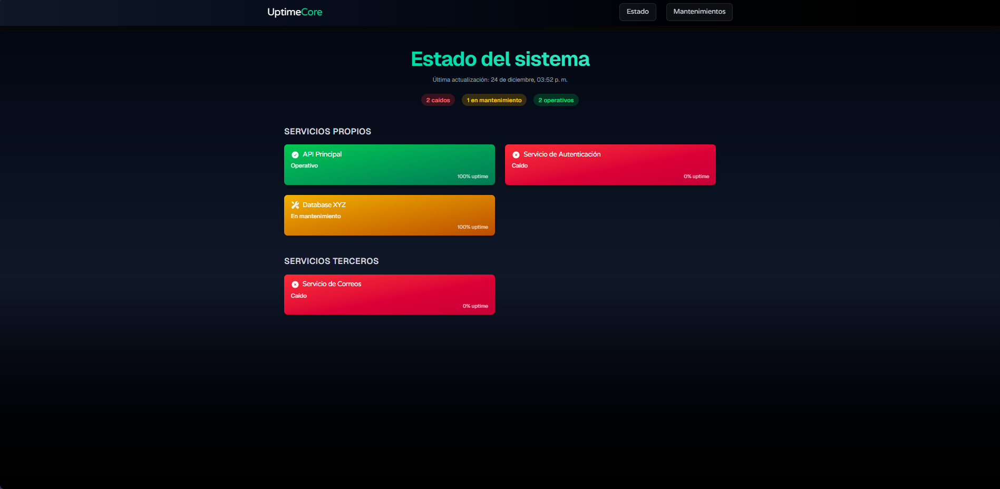

<div align="center">
  

  # UptimeCore

  **El núcleo que garantiza la disponibilidad de tus servicios.**  
  Dashboard moderno, emocional y confiable para monitoreo de estado y mantenimientos.

  [](https://nextjs.org/)
  [](https://tailwindcss.com/)
  [](https://www.framer.com/motion/)
  [](LICENSE)

  [🌐 Demo en vivo](https://uptimecore.vercel.app) · [🐛 Reportar issue](https://github.com/MosecX/uptimecore/issues)
</div>

---

## 🧠 ¿Qué es UptimeCore?

**UptimeCore** es una aplicación web diseñada para visualizar el estado de tus servicios en tiempo real, con una experiencia visual premium.  
Combina diseño emocional, animaciones suaves y glassmorphism para transmitir confianza y claridad.

---

## ✨ Características principales

- 🔍 **Resumen global animado** con estado general del sistema
- 📦 **Cards de servicio** con badges, uptime y mantenimiento
- 🧊 **Glassmorphism extendido** en navbar, cards y footer
- 🎬 **Animaciones con Framer Motion** para narrativa visual
- 📱 **Diseño responsive** para escritorio y móvil
- 🧠 **Tipografía emocional** con Varela Round
- ⚡ **Next.js 16.1.1** con App Router y optimización avanzada

---

## 🖼️ Captura de pantalla



---

## 🛠️ Tecnologías utilizadas

| Tecnología         | Descripción |
|--------------------|-------------|
| **Next.js 16.1.1** | Framework React con App Router, Server Actions y optimización avanzada |
| **Tailwind CSS**   | Utilidades para diseño rápido y responsivo |
| **Framer Motion**  | Animaciones suaves y escalonadas |
| **Varela Round**   | Fuente amigable y emocional |
| **Glassmorphism**  | Estilo moderno con blur y transparencia |

---

## 🚀 Instalación rápida

```bash
# Clona el repositorio
git clone https://github.com/MosecX/uptimecore.git
cd uptimecore

# Instala dependencias
npm install

# Corre en modo desarrollo
npm run dev
