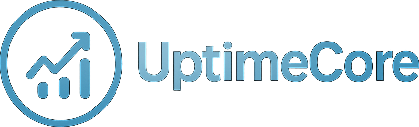
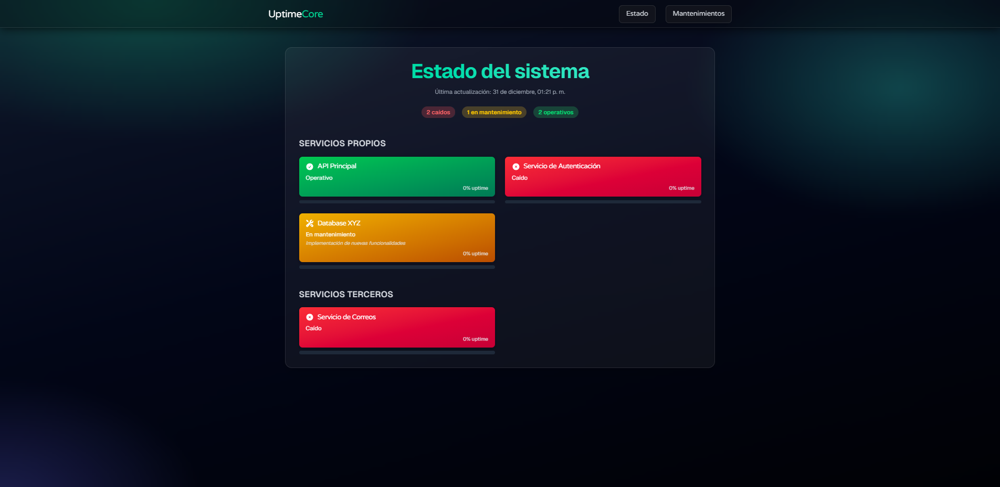
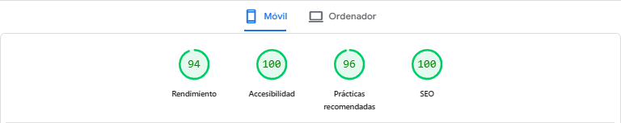
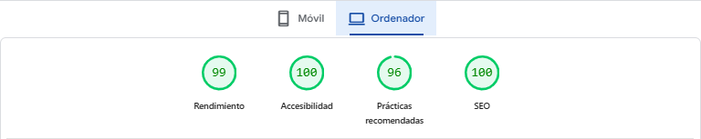

  

  # UptimeCore

  **El núcleo que garantiza la disponibilidad de tus servicios.**  
  Dashboard moderno, emocional y confiable para monitoreo de estado, mantenimientos y contacto directo.

  
  
  
  
  

  [🌐 Demo en vivo](https://uptimecore.vercel.app) · [📖 Documentación](https://docs-uptimecore.vercel.app) · [🐛 Reportar issue](https://github.com/MosecX/uptimecore/issues)

---

## 🧠 ¿Qué es UptimeCore?

**UptimeCore** es una aplicación web diseñada para visualizar el estado de tus servicios en tiempo real, con una experiencia visual premium.  
Combina diseño emocional, animaciones suaves y glassmorphism para transmitir confianza y claridad.  
Incluye **formulario de contacto integrado con envío de correos vía Gmail SMTP**.

---

## ✨ Características principales

- 🔍 **Resumen global animado** con estado general del sistema  
- 📦 **Cards de servicio** con badges, uptime y mantenimiento  
- 🧊 **Glassmorphism extendido** en navbar, cards y footer  
- 🎬 **Animaciones con Framer Motion** para narrativa visual  
- 📱 **Diseño responsive** para escritorio y móvil  
- 🧠 **Tipografía emocional** con Varela Round  
- ⚡ **Next.js 16.1.1** con App Router y optimización avanzada  
- 📧 **Formulario de contacto** con integración a `/api/contact` y envío directo vía Gmail SMTP  
- 🟢 **Optimización de rendimiento móvil** (97–100 Lighthouse)  

---

## 🖼️ Captura de pantalla

---

---

## 📖 Documentación

Toda la información sobre instalación, configuración, uso y contribución está disponible en la página oficial de documentación:

👉 [docs-uptimecore.vercel.app](https://docs-uptimecore.vercel.app)

---

## 📜 Licencia

Este proyecto está bajo la licencia **MIT**.  
Consulta el archivo `LICENSE` para más detalles.
